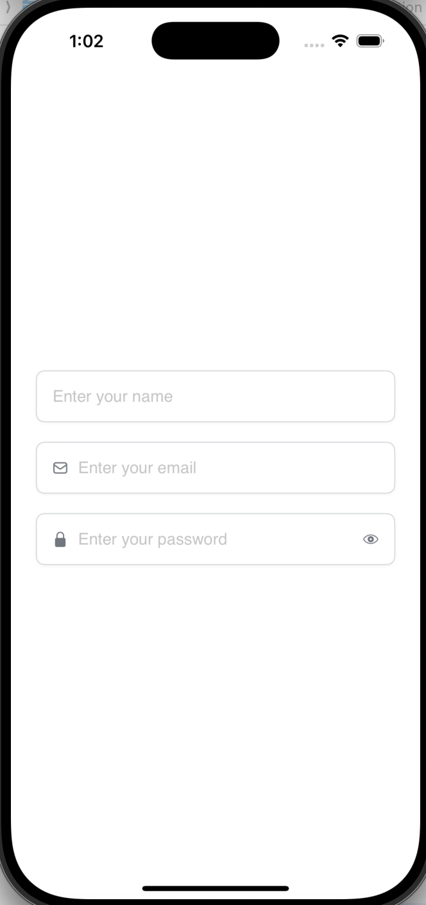
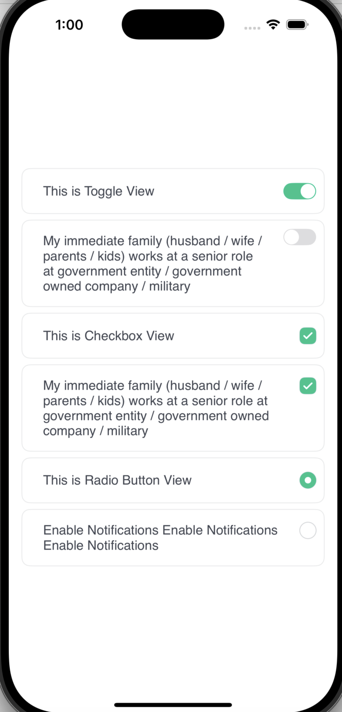

# MySwiftPackage
A Swift Package for reusable SwiftUI components, including button and text field modifiers with customizable styles, as well as custom views for Toggle, Checkbox, and Radio Button.

## Features

- **Predefined Button Styles:** Filled, Bordered, and Disabled
- **Customizable Button Modifiers:** Background, Border, and Text Colors
- **Buttons with Icons:** Support for left or right-positioned icons
- **Custom TextField Styles:** Adds padding, rounded borders, and optional icons
- **Custom Views for Selection Controls:** Reusable Toggle, Checkbox, and Radio Button components
- **Custom HeaderViews:** Header navigation bar with Back button, options button
- **Custom bottom bar content:** Bottom bar for options and Warnings or Error


## Usage

## 📌 Button Usage

CustomModifiers provides easy-to-use button styles with different designs.

### 🚀 Basic Button Styles
```swift
var body: some View {
        VStack(spacing: 10){
            Button("Continue"){ }
                .primaryButtonStyles(.filled())
            
            Button("Skip and verify later"){ }
                .primaryButtonStyles(.bordered())
 
            Button(""){ }
                .buttonWithImageStyle(.bordered(), image: Image(systemName: "star.fill"))
            
            Button("Sign Up"){
                print("Click Me")
            }.buttonWithImageStyle(.bordered(), image: Image(systemName: "person.fill"), imagePosition: .right)
                .frame(width: 250, height: 50)
            
            Button("Sign In"){
                print("Click Me")
            }.buttonWithImageStyle(.filled(), image: Image(systemName: "person.fill"), imagePosition: .left)
                .frame(width: 250, height: 50)
            
        }.padding(.horizontal, 20)
    }
```


### Styled TextFields

Use `textFieldModifier` to enhance your **TextField** with a clean design, including optional left and right icons.

```swift
 @State private var text: String = ""
 @State private var pass: String = ""

var body: some View {
        VStack(spacing: 20){
            TextField("Enter your name", text: $text)
                .textFieldModifier(.default)
            
            TextField("Enter your email", text: $text)
                .textFieldModifier(.default, iconLeft: Image("mail_icon"))
            
            SecureField("Enter your password", text: $pass)
                .textFieldModifier(.default, iconLeft: Image(systemName: "lock.fill"), iconRight: Image(systemName: "eye"))
        }.padding(25)
    }
```

### Styled TextFields

Use options fields to create the fields for ToggleView, CheckBox and Radio Button.

```swift
@State var isToggleOn = false
@State var selectedRadioID: String? = nil
@State var isSelected: Bool = false

var body: some View {
        VStack(spacing: 20){
           ToggleView(title: "This is Toggle View", isOn: $isToggleOn)
           CheckboxView(title: "This is Checkbox View", isSelected: $isSelected)
           RadioButton(title: "This is Radio Button View",  id: "1", selectedID: $selectedRadioID)
        }.padding(25)
    }
```

| Buttons | Textfields | OptionFields |
|---------|------------|--------------|
|  |  |  |

### Custom Header Items

Use options header fields for Navigation bar and Title and SubTitle Textviews.

```swift
VStack(alignment: .leading ,spacing: 15){
//Custom Navigation bar with click listener
            CustomNavBar(showBackButton: true, onBack: {
                print("on Back pressed")
                showWarning = true
            }, showOptionsButton: true) {
                print("on menu pressed")
                showMenu = true
            }
//Custom Title and subtitle bar.
            VStack(alignment: .leading){
                CustomTitleBar(title: "Employement Status", subtitle: "This is the subtitle i want to test it out This is the subtitle i want to test it out")
            }
}
```

### Custom Bottom Sheet

Use options header fields for Navigation bar and Title and SubTitle Textviews.

```swift
Content.
 .sheet(isPresented: $showMenu) {
            MenuListView(
                title: "Menu",
                items: menuItems,
                onSelect: { selected in
                    showMenu = false
                },
                onDismiss: {
                    showMenu = false
                }
            )
        }
        
        .sheet(isPresented: $showWarning) {
                WarningView(
                    iconName: "error_icon",
                    title: "Success",
                    message: "Your action was successful Your action was successful Your action was successful Your action was successful",
                    primaryButtonTitle: "Continue",
                    onPrimary: {
                        showWarning = false
                    },
                    secondaryButtonTitle: "Cancel",
                    onSecondary: {
                        showWarning = false
                    },
                    onDismiss: {
                        showWarning = false
                    }
                )
        }

```

| HeaderView | Option Sheet | Alert Sheet |
|---------|------------|--------------|
|  |  |  |


