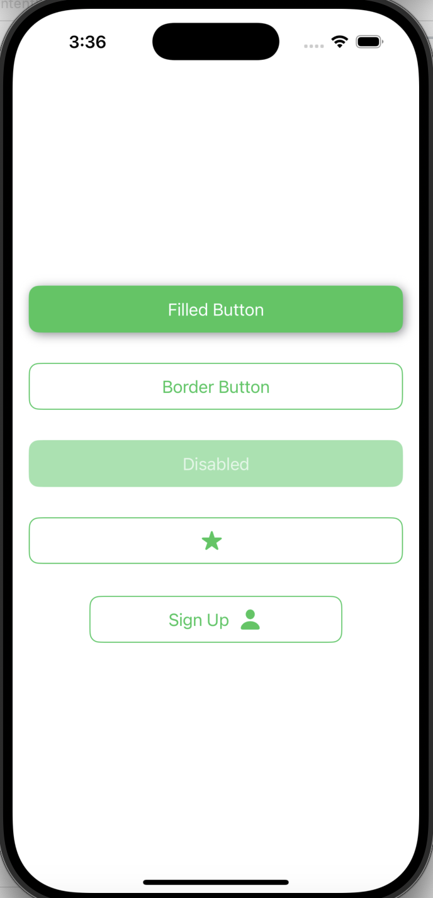
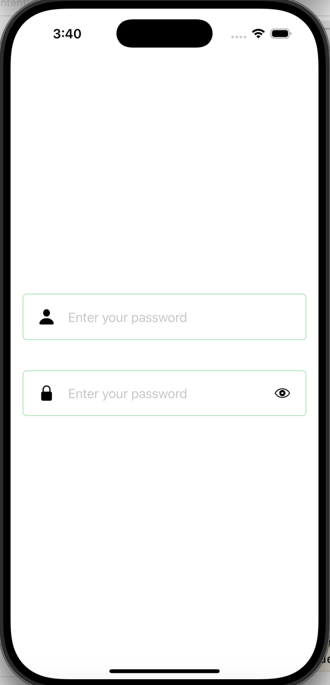

# MySwiftPackage
A Swift Package that provides reusable SwiftUI button and text field modifiers with customizable styles, including filled, bordered, and disabled states.

## Features

- **Predefined Button Styles:** Filled, Bordered, and Disabled
- **Customizable Button Modifiers:** Background, Border, and Text Colors
- **Buttons with Icons:** Support for left or right-positioned icons
- **Custom TextField Styles:** Adds padding, rounded borders, and optional icons


## Usage

## 📌 Button Usage

CustomModifiers provides easy-to-use button styles with different designs.

### 🚀 Basic Button Styles
```swift
Button("Submit") { }
 .primaryButtonStyles(.filled())

Button("Submit") { }
 .primaryButtonStyles(.bordered())

Button("Submit") { }
 .primaryButtonStyles(.disabled())

// Button with Left Icon
Button("") { }
    .buttonWithImageStyle(.bordered(), image: Image(systemName: "star.fill"))

// Button with Right Icon
Button("Sign Up") {
    print("Click Me")
}
.buttonWithImageStyle(.bordered(), image: Image(systemName: "person.fill"), imagePosition: .right)
.frame(width: 250, height: 50)
```


### Styled TextFields

Use `textFieldModifier` to enhance your **TextField** with a clean design, including optional left and right icons.

```swift
import SwiftUI
import CustomModifiers

struct ContentView: View {
 @State private var text: String = ""
 @State private var pass: String = ""

 var body: some View {
     VStack(spacing: 20) {
         // TextField with Left Icon
         TextField("Enter your username", text: $text)
             .textFieldModifier(.default, iconLeft: Image(systemName: "person.fill"))
             .padding(.vertical, 10)

         // SecureField with Left and Right Icons
         SecureField("Enter your password", text: $pass)
             .textFieldModifier(.default, iconLeft: Image(systemName: "lock.fill"), iconRight: Image(systemName: "eye"))
             .padding(.vertical, 10)
     }
     .padding()
 }
}
```
| Buttons | Textfields |
|---------|------------|
|  |  |

